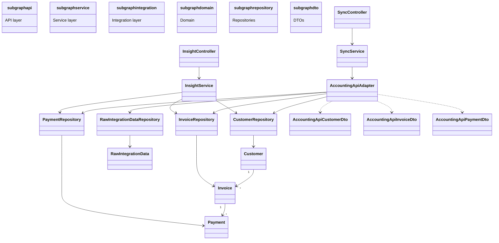
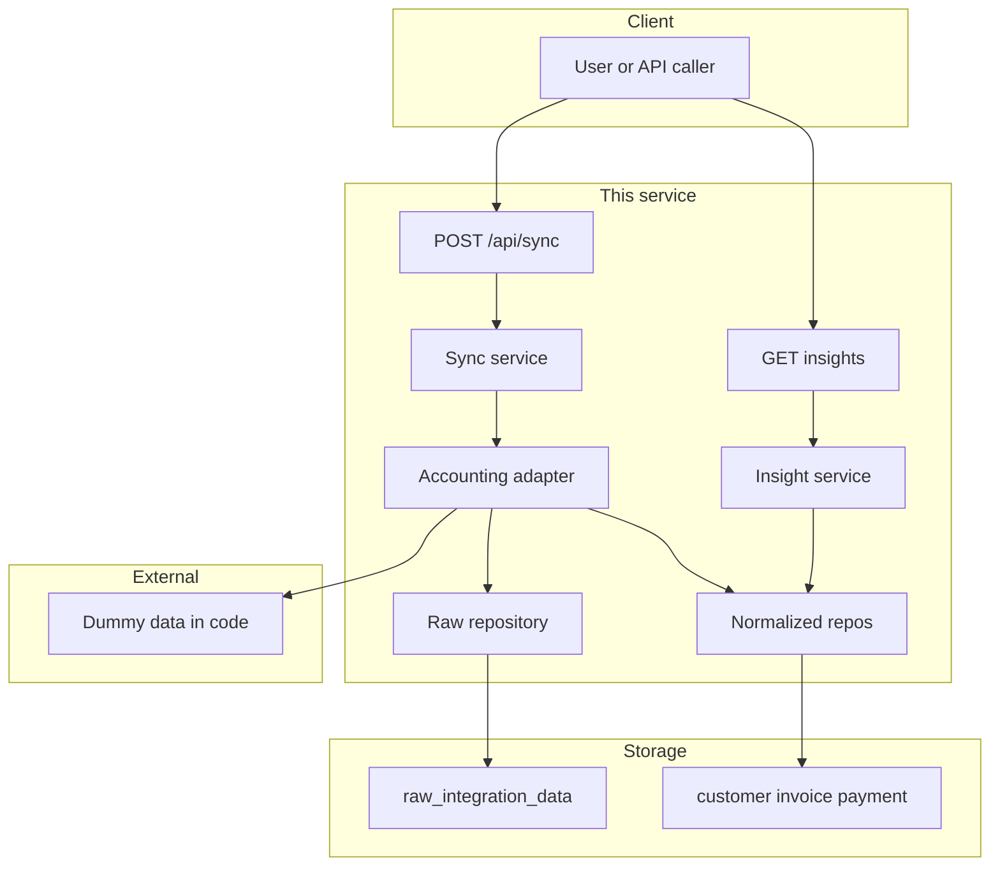
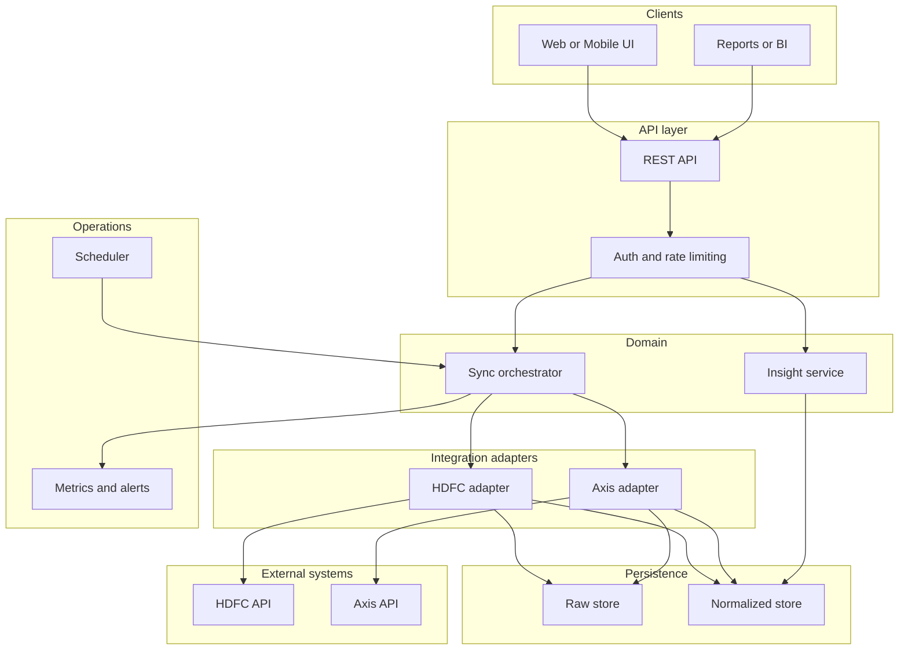

# Takaada Integration Service

Accounting integration service with analysis. This service integrates with an external accounting system (customers, invoices, payments), stores data locally in two forms—**raw** (source format for audit) and **normalized** (common schema for analysis)—and exposes APIs for financial insights such as outstanding balances and overdue invoices.

- **On-demand sync**: Trigger sync via `POST /api/sync` (uses dummy data in code; comments indicate where the real API would be called).
- **Insights**: Outstanding balance per customer, list of overdue invoices.
- **Stack**: Java 17, Spring Boot 3.x, H2, Maven.

---

## What it is

A small integration service that:

1. **Fetches** customer, invoice, and payment data from an external accounting API (in this assignment, dummy data in code).
2. **Stores** each response in **raw** form (exact payload per source) and in a **normalized** form (common `Customer`, `Invoice`, `Payment` schema) so different sources (e.g. HDFC, Axis) can have different API shapes while the app exposes one consistent model.
3. **Exposes** insight APIs: per-customer outstanding balance and overdue invoices.

The design supports multiple external sources with different request/response formats; each adapter writes raw + normalized, and all analysis reads only from normalized tables.

---

## Setup and run

**Prerequisites**

- JDK 17. Check: `java -version`

**Steps**

1. Clone or unzip the project and open a terminal in the project root (where `pom.xml` is).
2. Run the application:
   ```bash
   mvn spring-boot:run
   ```
   First run will download dependencies. H2 starts automatically; data is stored in `./data/takaada`.
3. Trigger sync (on-demand; uses dummy data):
   ```bash
   curl -X POST http://localhost:8080/external/sync
   ```
4. Call insight APIs:
   ```bash
   curl http://localhost:8080/insights/invoices/overdue
   curl http://localhost:8080/insights/customers/1/outstanding-balance
   ```
   Use customer IDs returned after sync (e.g. 1, 2).

**Build**

- Compile: `mvn compile`
- Package: `mvn package`
- Run JAR: `java -jar target/takaada-integration-service-0.0.1-SNAPSHOT.jar`

---

## API endpoints

| Method | Path | Description |
|--------|------|-------------|
| POST | `/api/sync` | Run on-demand sync (fetch from source, store raw + normalized). This can be extended to scheduled jobs |
| GET | `/api/customers/{customerId}/outstanding-balance` | Outstanding balance for a customer. |
| GET | `/api/invoices/overdue` | List of overdue invoices with balance and days overdue. |

---

## Class diagram

High-level structure of the main classes and their relationships:



---

## System design

### Basic design (this assignment)

Single service, on-demand sync, dummy data in code, H2. Sync and insight APIs in one process.



### Ideal design (production-style)

Multiple sources (e.g. HDFC, Axis), scheduled sync, real HTTP APIs, auth, and observability. Same patterns: per-source adapters, raw + normalized storage, insight layer on normalized data only.



The basic design reflects this assignment (one adapter, on-demand sync, dummy data, single process, H2). The ideal design extends the same ideas to multiple bank adapters, scheduled sync, real APIs, and clearer API/ops boundaries.
